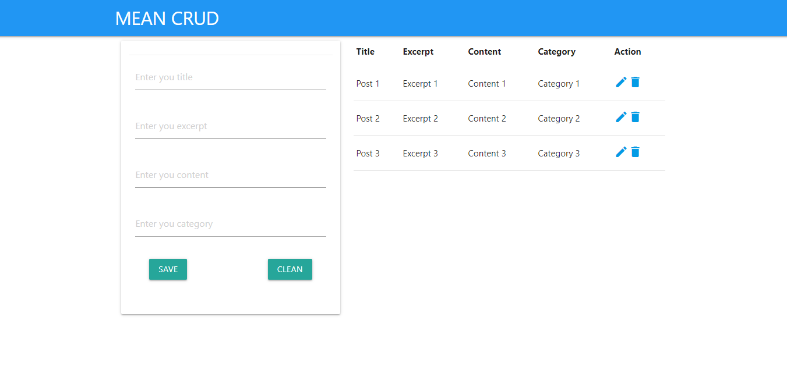

# NodeJS y Angular
MEAN STACK.

Tecnologías:
- MongoDB.
- Express.
- Angular.
- NodeJS.

Módulos:
- Framework: `npm i express`.
- Configura los headers Access-Control-Allow-Origin: `npm i cors`.
- Visualiza por consola las peticiones que van llegando por servidor `npm i morgan`.
- Conectar express a una base de datos: `npm i mongoose`.
- Reinicia el servidor automaticamente al guardar cambios `npm i nodemon -D`.

Esta app puede:
- Crear/Leer/Actualizar/Eliminar Posts.

# Screenshot

# Guía de instalación backend
1. Descarga el repositorio.
2. Descomprime la carpeta dentro del directorio que desees.
3. Renombra la carpeta (Opcional).
4. Crea una base de datos para el proyecto en MongoDB Local (Software utilizado Robo 3T).
5. Entra a la carpeta desde la terminal `cd directorio/de/la/carpeta`.
6. Ejecuta `npm install`.
7. Ejecuta `npm run start` o `npm start`.

# Guía de instalación frontend
1. Entra a la carpeta frontend desde la terminal `cd directorio/de/la/carpeta/frontend`.
2. Ejecuta `npm install`.
3. Ejecuta `ng serve`.
4. Abre un navegador y escribe la dirección `http://localhost:4200/`.
5. Ya puedes utilizar la aplicación.

# License

#### Todos los proyectos creados por Alex Ku Dzul están bajo la [licencia MIT](https://opensource.org/licenses/MIT).